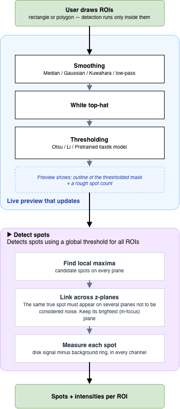
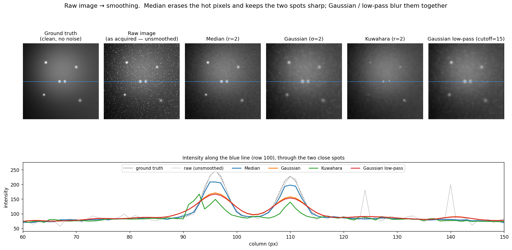
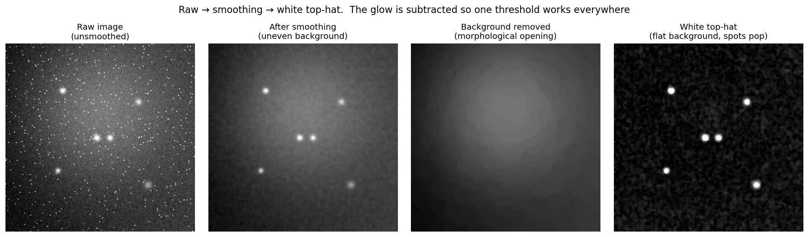

# Spot Quant — detection basics

## Pipeline

Draw ROIs, tune smoothing → white top-hat → thresholding on a live single-plane
preview, then press **Detect spots** to run the full z-stack (find maxima → link
across z → measure in every channel).

## Smoothing

Runs first, to stop random noise and hot pixels being read as spots. You pick the
method and size; the preview updates live.

- **Median** (default) — removes hot pixels and outliers, keeps spots sharp.
- **Gaussian** — smooths gentle noise, but blurs spots and only smears hot pixels.
- **Kuwahara** — preserves edges, but can look blocky and lower peak brightness.
- **Gaussian low-pass** — very smooth, but softens spots (here a *bigger* size = *less* blur).

## White top-hat

Subtracts the uneven background glow, leaving spots on a flat field so one
threshold works everywhere.

## Linking across z-planes

A real spot appears on several planes as you focus through it. Linking joins its
per-plane detections into one 3-D track, keeps the brightest (in-focus) plane, and
measures there. A track seen on only one plane is treated as noise and dropped.

## Cells: mother / bud (optional)

Uses **micro-sam** to segment the yeast cells on the brightfield channel.
**Segment cells (micro-sam)** finds the cells; **Auto: all ROIs** then tags each
ROI — the bigger cell is the mother, the smaller the bud (mother outlined cyan,
bud yellow, each labelled). With spots detected it also tags each dot (mom / bud /
in-mom-toward-bud). Fix mistakes by hand with **Pick mom** / **Pick bud**,
**Remove pick**, or by drawing a cell polygon. Needs the `micro_sam` package.
